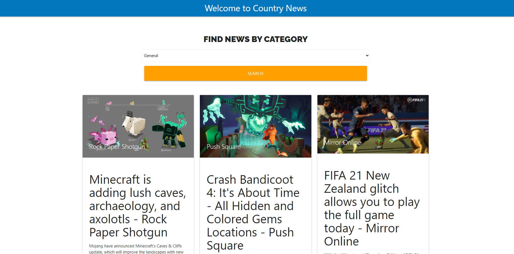

# country-news

 

## Built With

* [React](https://reactjs.org/)
* [React Hooks](https://es.reactjs.org/docs/hooks-intro.html)
* [NodeJs](https://nodejs.org/en/)
* [JavaScript](https://en.wikipedia.org/wiki/JavaScript)
* [Css](https://en.wikipedia.org/wiki/CSS)
* [News API](https://newsapi.org/)


## Getting Started

### Prerequisites

For this project you need:

```
Nodejs
```

### Installing

Go to country-news/client and run:

```
npm install
```

## Running React

In the same folder run:

```
npm start
```

Now you can use Country News React App!
